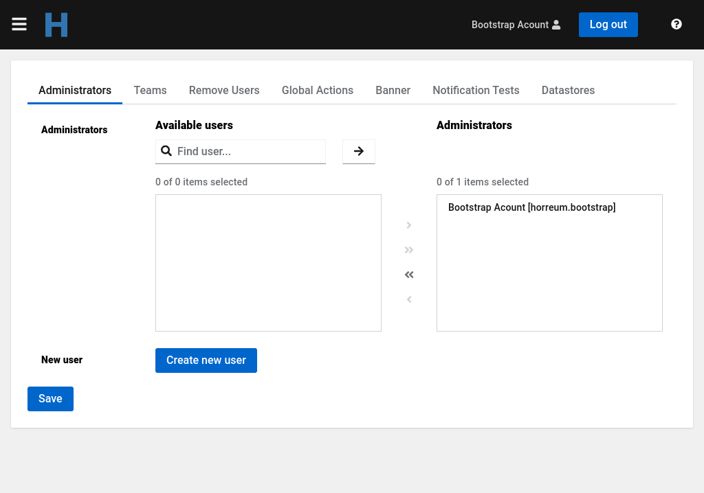
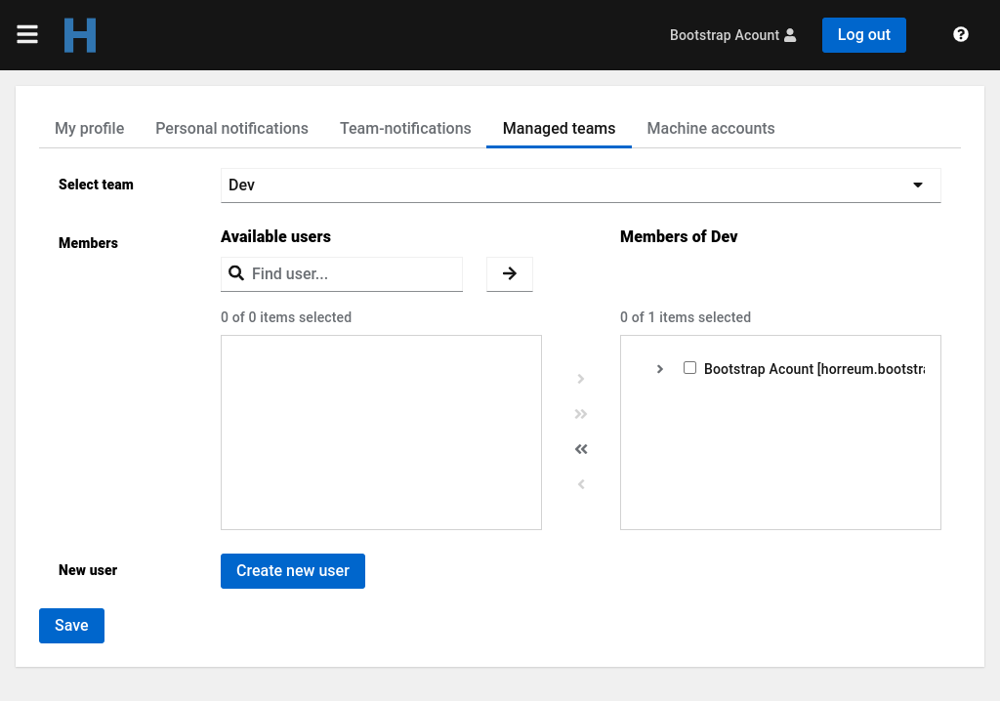
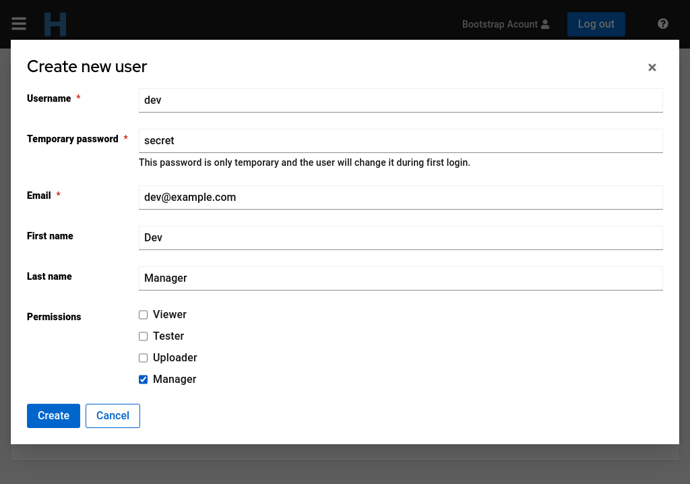
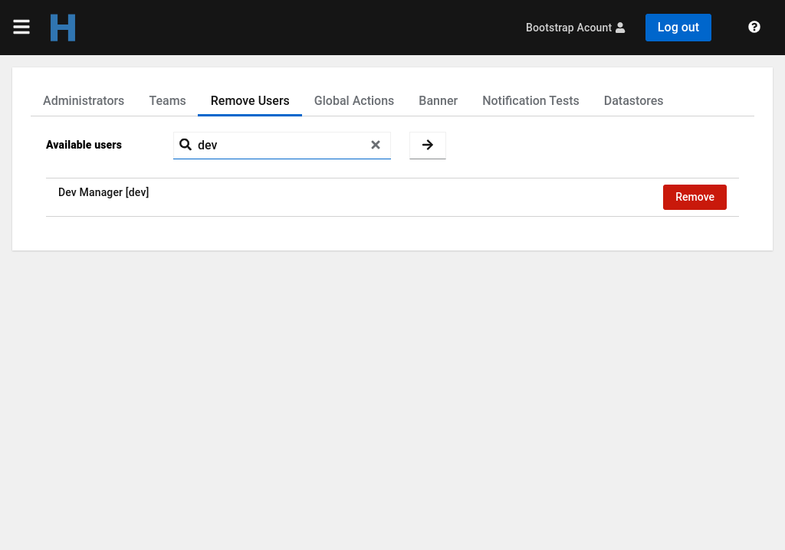

It is assumed that the repo will host data for multiple teams; each user is a member of one or more teams.
Each run, test or schema is owned by one of the teams. The team corresponds to a Keycloak role (see below) with `-team` suffix, e.g. `engineers-team`. In the UI this will be displayed simply as `Engineers`, dropping the suffix and capitalizing the name.

## Data access

We define 3 levels of access to each item (test, run, dataset or schema):

- public: available even to non-authenticated users (for reading)
- protected: available to all authenticated users that have the `viewer` role (see below)
- private: available only to users who 'own' this data - those who have the team role.
     

## Users and roles

There are few generic roles automatically created during initial realm import.

- `viewer`: read permission to view non-public runs
- `uploader`: write permission to upload new runs, useful for bot accounts (CI)
- `tester`: write permission to define tests, modify or delete data.
- `manager`: read/write permission to manage team members and their roles within the team
- `admin`: permission both see and change application-wide configuration such as global actions

The `admin` role is a system-wide role and is not restricted to a particular teams.
           
## API Keys

Users can generate an API key, that will provide programatic access to the Horreum API with the same authorization permissions as the user who created the API Key.

## User authentication

There are three possibilities to authenticate users. Users and roles can be managed in a dedicated Keycloak instance, in Horreum itself, or a mixed mode with both Horreum and an external OpenID provider.

### Managed keycloak instance

In this mode users and teams are stored in a Keycloak instance that Horreum can manage. In non-production environment it can be reached it on [localhost:8180](http://localhost:8180/) using credentials `admin`/`secret`.

Besides the team role itself (e.g. `engineers-team`) there must be a composite roles for each team combining the team role and permission role: bot account that uploads team's data will have `engineers-uploader` which is a composite role, including `engineers-team` and `uploader`. This role cannot view team's private data, it has a write-only access.
Users who explore runs, create and modify new tests should have the `engineers-tester` role; a composite role including `engineers-team`, `tester` and `viewer`.
You can also create a role that allows read-only access to team's private runs, `engineers-viewer` consisting of `engineers-team` and `viewer`.

### Horreum

It is possible to run Horreum without any external service for authentication. That is enabled with a combination of `horreum.roles.provider=database` while leaving the `horreum.keycloak.url` property undefined. This mode relies on HTTP Basic authentication. Users are managed in Horreum's own database.

### OpenID Connect (OIDC) provider

Authentication is handled by an outside OpenID provider. Users and roles are managed in Horreum and therefore the `horreum.roles.provider` property must be set to `database`. Users need to be created in Horreum with a username that match the one registererd with the OpenID provider. (It's assumed the users are already registered with the provider, but they still need to be created in Horreum to define their teams and roles)

This mode requires setting `horreum.keycloak.url` and `quarkus.oidc-client.auth-server-url` properties, as well as the client authentication details shared by the provider. For further details on the client configuration see the [Quarkus OIDC Reference Documentation](https://quarkus.io/guides/security-openid-connect-client-reference#oidc-client) on the subject. 

## Bootstrap account

Horreum configures one admin account when there are none. This allows the initial configuration of Horreum.

This account has `horreum.bootstrap` as the username and the password is `secret` in non-production enviroment. In production this account has a generated random password that is shown in the logs.

Once other admin accounts are created the bootstrap account should be removed.
                                                                                 

## Create User

Administrators can create users in the `Administators` panel and after that assign them to teams with the appropriate roles.
                    

Team managers can also create new users on the `Managed Teams` panel on their user profile. The new user will be associated with the selected team.
                           

                                                       
In both cases, a form needs to be filled with the user details. 
                                                    

   

## Remove User

Only Administrators can remove users. For that, navigate to the `Remove Users` panel and search for the users to be removed. After that click on the red `Remove` button and confirm.

