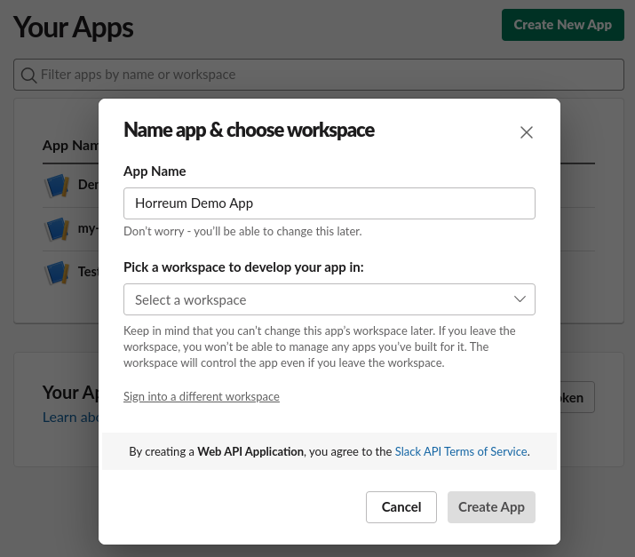
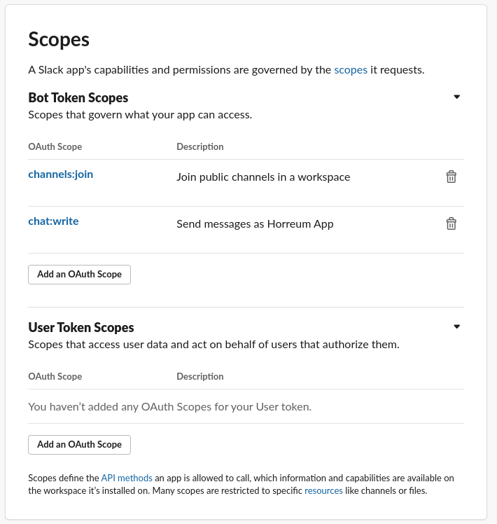
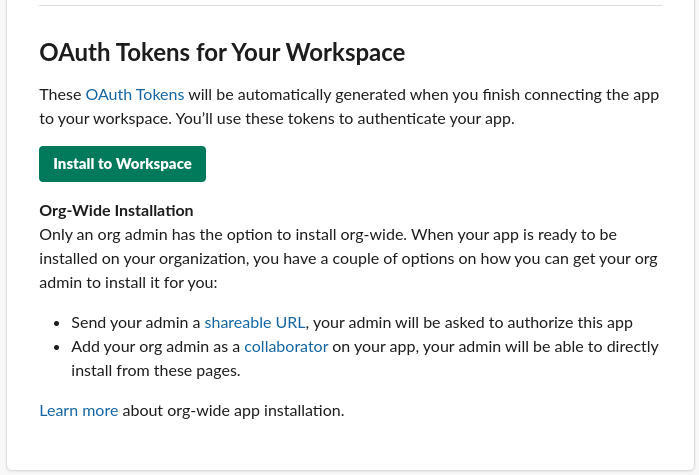
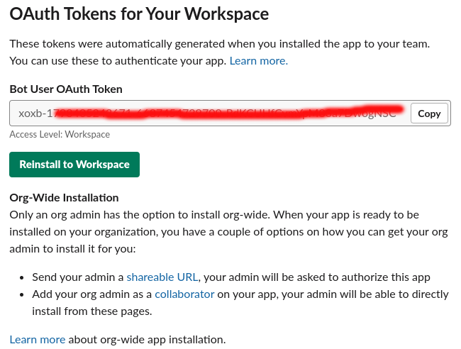
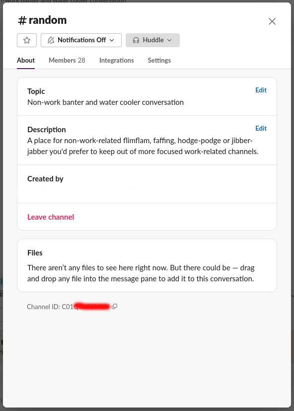
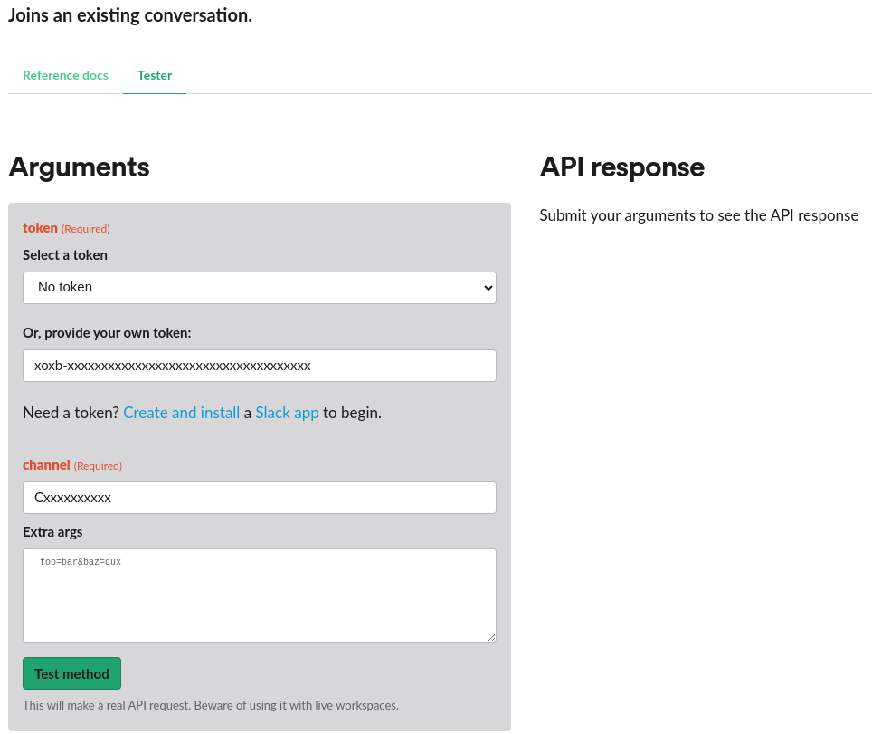

Horreum can be configured to post messages to a Slack channel through the
`slack-channel-message` action. Actions can be triggered on various Horreum
lifecycle events: see [Configure Actions](../../Tasks/configure-actions/index.md)
for details.

## Configuration

Before you can configure a Slack action, either globally or for a specific
test, you'll need to create and install a "Slack application" as a bot allowed
to post messages to a specific Slack channel.

1. Create a Slack App. You can do this through the
[Slack development CLI](https://api.slack.com/automation/cli/install), or
by clicking "Create New App" on the web interface at
[Slack Apps](https://api.slack.com/apps):

2. Open the "OAuth & Permissions" tab and scroll down to the "Scopes" header.
Add your scopes by clicking on the "Add an OAuth Scope" button. The Horreum
Slack Action requires the `channels:join` and `chat:write` scopes:

3. Once you've created the app, you'll need to install it in your Slack workspace.
Depending on the workspace, you may need to request approval from a workspace
administrator:

4. Once installation is complete, Slack will give you a "BotUser OAuth Token"; a
long string that should start with "xoxb-". This token identifies and authenticates
your app (in this case, the Horreum server) to Slack, and you'll need to provide
this value to Horreum as the `token` secret when configuring an Action.

5. Now you need to give your app permission to post to your chosen Slack channel
by using your token to "join" the channel. In the Slack UI (either the web UI or
in the Slack app), you can right-click on the channel and choose "View channel
details". At the bottom of the sheet that opens you should see an alphanumeric
string labeled "Channel ID", with a "copy to clipboard" icon following the value.

Navigate to the online [conversations.join Test API](https://api.slack.com/methods/conversations.join/test)
and enter the OAuth bot token and the Channel ID in the input boxes, and click "Test method".
You should get a success API response, and you (and Horreum) can now use your OAuth token to
post bot messages to the designated Slack channel ID.

## Configuring a Horreum Slack Action

Using either the API or the UI, you can create a Slack Action globally or
for a specific Test. You will supply both the Slack channel ID and the Slack App
bot token you created earlier, along with specifying the particular event and
formatted template you want to post.

TBD
