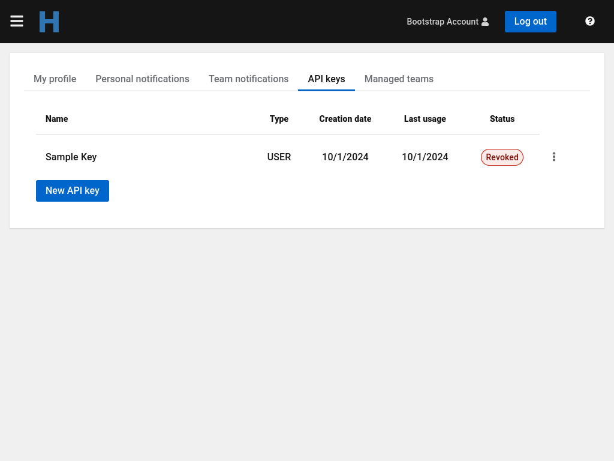

     
Horreum users authenticate using the Open ID Connect (OIDC) authentication protocol. However, in some circumstances it may not be possible to use OIDC. For those cases there is an alternative authentication mechanism in the form of API Keys.

API keys are tokens that grant access to certain parts of the Horreum API. In general, API Keys are associated with a user.

## API Key creation

A user can manage its API Keys on the `API Keys` tab on the user profile (click on the name in upper right corner). The button `New API Key` brings up the `Create new API Key` dialog.


The key name is optional, but it's recommended that every key has a name that reflects the reason it was created and/or where it's used. 
At the moment the API keys give the same level of access the user has, but in the future there may be different types of keys that the user has to choose from.
After the request is submitted the new key is revealed.  
       

                     
The user should copy the API Key, and is responsible for keeping it secret. Horreum API Keys are non-retrievable, which means they are not stored anywhere on the system. Once this dialog is closed it's not possible to display the API key again.
        
## API Key usage

Horreum clients allow an API Key to be specified in their configuration. Other clients need to add the `X-Horreum-API-Key` HTTP header with the key value. For example, the `curl` command to use should be:   

```
$ curl -H 'X-Horreum-API-Key: HUSR_00000000_0000_0000_0000_000000000000' [...]
```

## API Key management

The user can manage its own API Keys in the `API Keys` tab on their user profile. The fields displayed for each key are:
 * Key name: The name given to the key
 * Key type: The level of access the key provides
 * Creation date: The date the key was created
 * Last usage: The date the key was used for the last time
 * Status: Shows if the key is valid or has expired / has been revoked. It also shows if the key is about to expire.


For each key there are two possible actions:
 * Rename: Changes the key name 
 * Revoke: Remove the access rights for the key. This action can't be undone. The user should revoke a compromised key immediately.



## API Key expiration

Keys that have not been used for a while (last 30 days) are automatically revoked. Users are notified in advance using the methods provided for `Personal notifications`.
