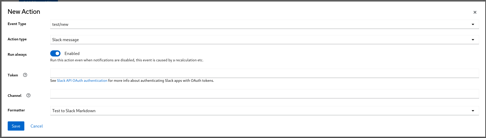

In the [change detection guide](/docs/tasks/configure-change-detection) you've seen how can you inform users about changes in your project's performance. You can use another mechanism to notify other services about noteworthy events, e.g. bots commenting on version control system, updating status page or triggering another job in CI: the webhooks. Event [`Actions`](/docs/concepts/core-concepts#actions) are produced in the following situations:

- New Run event
- New Change Detection event
- Experiment Result event

Additionally, [`Global Actions`](/docs/concepts/core-concepts#global-action) have one additional event type:

- New Test event

This allows remote systems or users to rely on automation that can reduce the necessity of manual tasks. Since calling arbitrary services in the intranet is security-sensitive, Horreum administrators have to set up an [`Action Allow list`](/docs/concepts/core-concepts#action-allow-list) of URL prefixes (e.g. domains). There are a variety of Webhook implementations provided by Horreum:

- Generic HTTP POST method request
- Github Issue Comment
- Create a new Github Issue
- Post a message to a Slack channel

As a user with the `admin` role you can see 'Administration' link in the navigation bar on the top; go there and in the [`Global Actions`](/docs/concepts/core-concepts#global-actions) tab hit the 'Add prefix' button:

{}
Define action prefix
{}

When you save the modal you will see the prefix appearing in the table. Then in the lower half of the screen you can add global actions: whenever a new Test is created, a [`Run`](/docs/concepts/core-concepts#run) is uploaded or Change is emitted Horreum can trigger an action.

Test owners can set [`Actions`](/docs/concepts/core-concepts#actions) for individual tests, too. Go to the Test configuration, 'Actions' tab and press the 'New Action' button. This works identically to the global actions.

{}
Define test webhook
{}

Even though non-admins (in case of global hooks) and non-owners of given test cannot see the URL it is advisable to not use any security sensitive tokens.

[^1]: In this case the JSON path is evaluated in the application, not in PostgreSQL, therefore you need to use the [Jayway JSON Path syntax](https://github.com/json-path/JsonPath) - this is a port of the original Javascript JSON Path implementation.

## HTTP Web Hook Action

Horreum can issue an HTTP POST request to a registered URL prefix, using the new JSON-encoded entity as a request body. You can also use a JSON path[^1] wrapped in `${...}`, e.g. `${$.data.foo}` in the URL to refer to the object sent.

{}
Define action prefix
{}

## GitHub Issue Create Action

Horreum can create a GitHub issue against a named user (or organization) repo on a "change/new" event type. Horreum creates a GitHub formatted markdown representing the event.

You supply the owner, repository, issue title, and a [GitHub token for authentication](https://docs.github.com/en/authentication/keeping-your-account-and-data-secure/creating-a-personal-access-token).

## GitHub Issue Comment Action

Horreum can add a comment to an existing GitHub issue on an "experiment_result/new" event, identifying the issue either by owner, repo, and issue number, or by a complete GitHub URI, and a [GitHub token for authentication](https://docs.github.com/en/authentication/keeping-your-account-and-data-secure/creating-a-personal-access-token).

## Slack Channel Message Action

Horreum can post a comment to a Slack channel on a "test/new", "change/new", "experiment_result/new", or "test/new" event. Horreum creates a formatted markdown representing the event.

You supply the Slack channel ID, and a [Slack app OAuth token](../../Integrations/slack/index.md).

