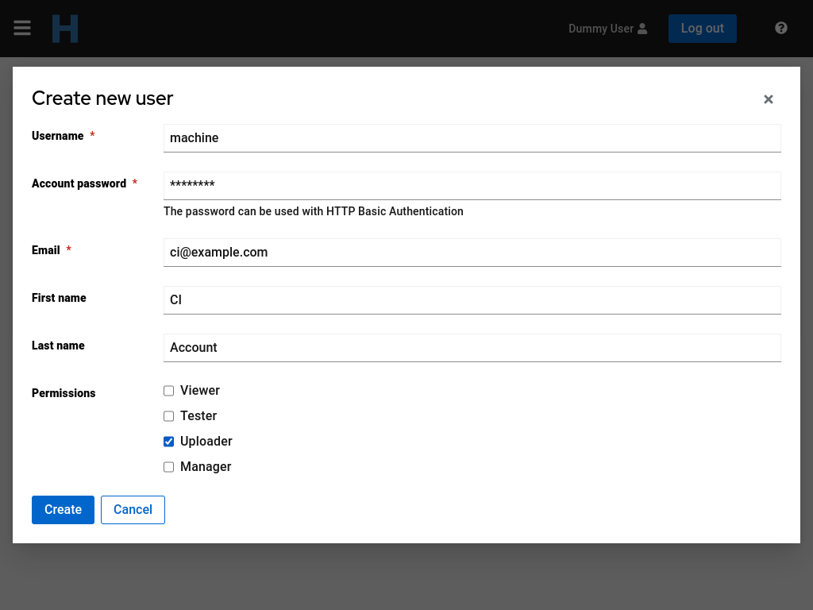
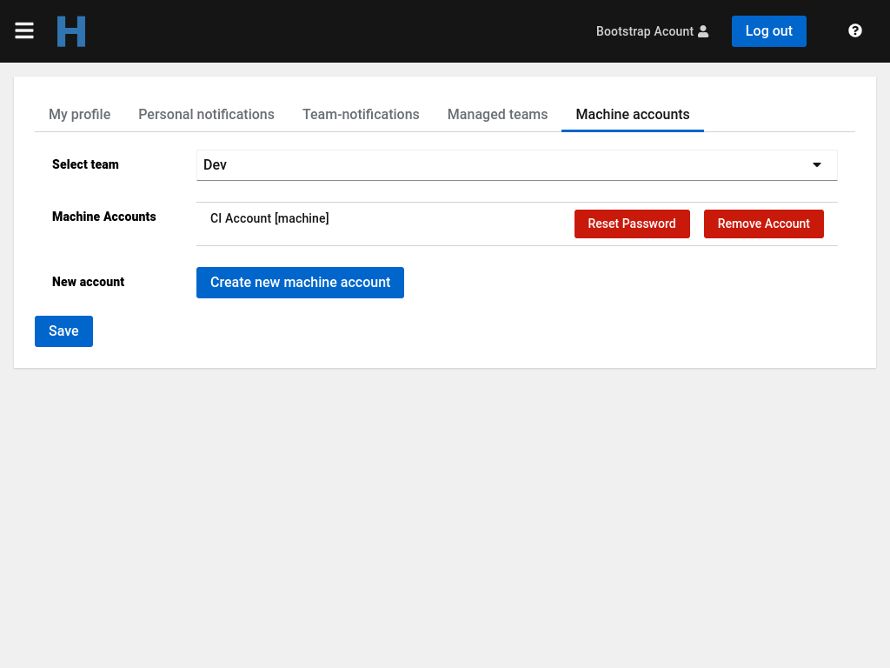
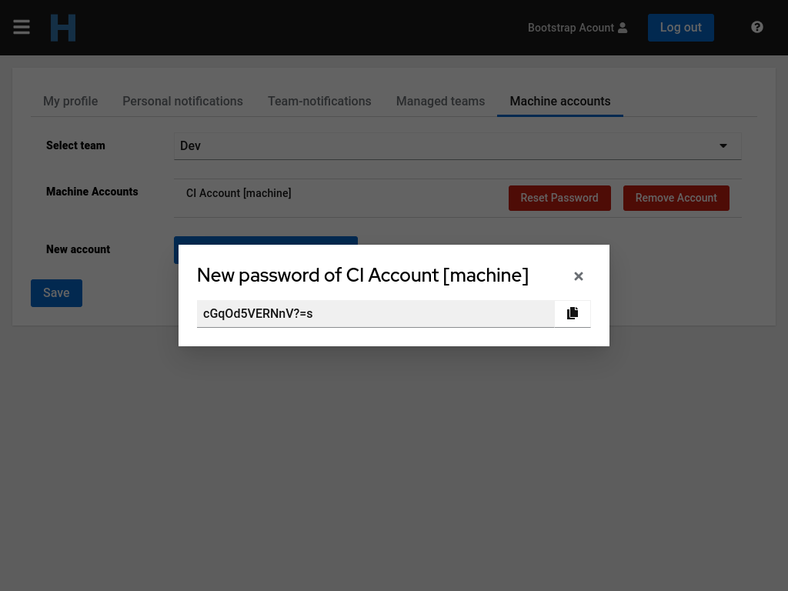

A team manager can create `Machine Accounts` for their managed team(s). Those accounts can access Horreum with HTTP Basic authentication instead of authenticating with Keycloak. This is done on the `Machine Accounts` tab on the user profile (click on your name in upper right corner).

After an account is created it is visible in the list of `Machine Accounts`. Multiple accounts can be created for a team.

To change the password of an existing account click on the red `Reset Password` button and confirm. A dialogue with the new generated password appears. Copy the password and close the dialogue. This is the only time the password is visible.

In the same panel it's possible to remove the accounts. For that click on the red `Remove Account` button and confirm.
